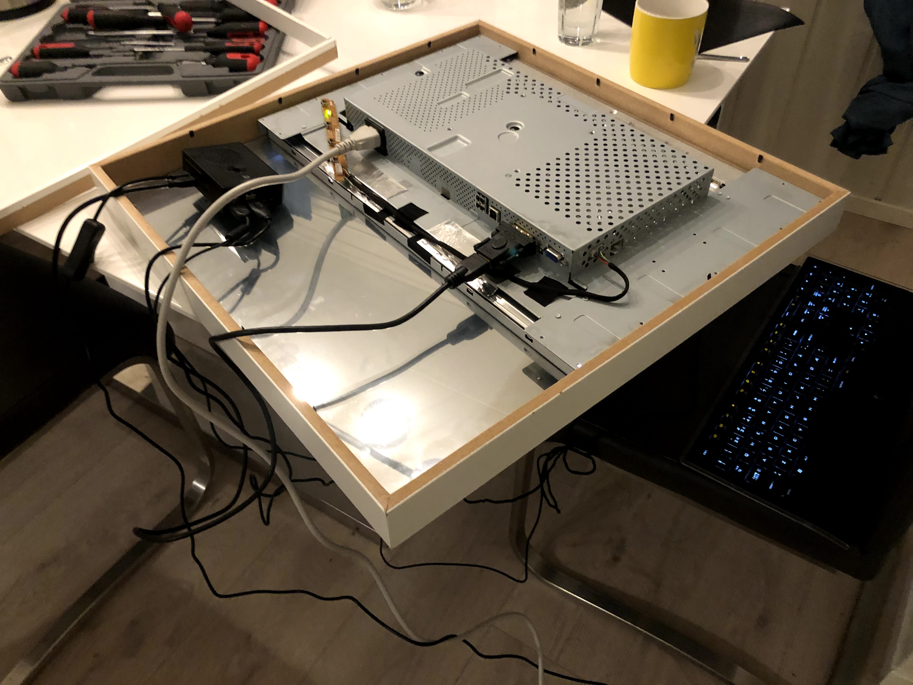
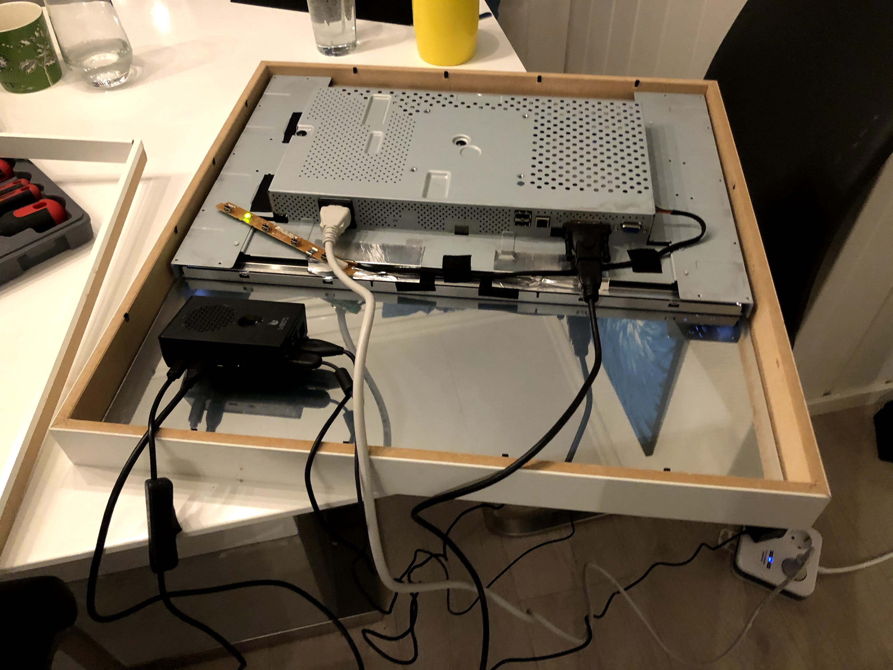
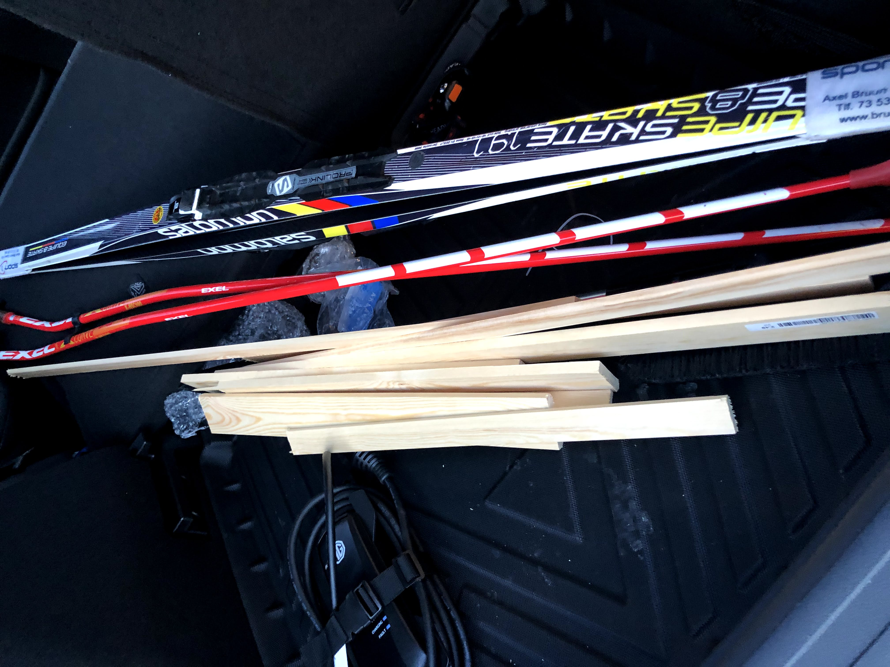

# magic-mirror
Documentation of my magic mirror project.

## Parts

* An old mirror from a buddy of mine, thanks https://github.com/trondkla.
* Wooden frame
* A raspberry pi 4
* An old used 22" screen. 
* power tools!

## Build log

### Humble beginnings

I got the old used frame from a friend of mine, he had previously created a magic mirror but no longer used it. I also bought a raspberry and a used old 22 inch screen from finn.no

After this I had to test the setup to see if it would fit. 

I used a screwdriver to disassemble the plastic coverings from the screen, and then placed it inside th frame to test the dimensions. 

Unfortunately the screen is way too deep for the frame. So, I had to build a new one.

### Building a new frame

The next step was to get some materials to build the new frame. I first did a 3D-model of the frame to get a sense of how it would look like, and I found great joy in trying to use a new tool.

When I was pleased with the 3D-model I went out to the local hardware store and bought my materials. 

