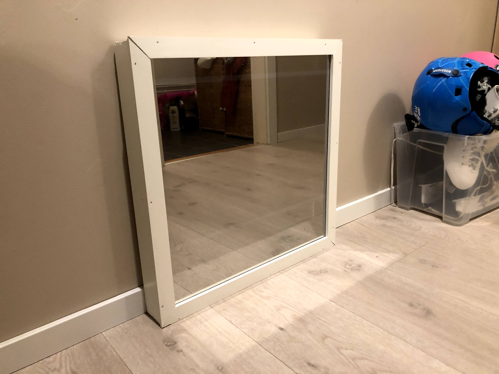

# magic-mirror
Documentation of my magic mirror project.

# Parts

* An old mirror from a buddy of mine, thanks https://github.com/trondkla.
* Wooden frame
* A raspberry pi 4
* An old used 22" screen. 
* power tools!

# Build log

## Humble beginnings

I got the old used frame from a friend of mine, he had previously created a magic mirror but no longer used it. I also bought a raspberry and a used old 22 inch screen from finn.no

After this I had to test the setup to see if it would fit. 

I used a screwdriver to disassemble the plastic coverings from the screen, and then placed it inside th frame to test the dimensions. 

Unfortunately the screen is way too deep for the frame. So, I had to build a new one.

## Building a new frame

The next step was to get some materials to build the new frame. I first did a 3D-model of the frame to get a sense of how it would look like, and I found great joy in trying to use a new tool.

When I was pleased with the 3D-model I went out to the local hardware store and bought my materials. 

My workbench is the same bench I use to wax my skis!

When i started to assemble the frame I unfortunately found out that my say blade should be changed, and I got some bad cuts. 

I decided to use some 90 degree angles to reinforce the frame. This decision I was happy with in the final product, because when the frame was hung on the wall there was much more force on it, than I had expected, however due to the durable angles, it held together beautifully. 

After I had cut the parts I had a test assembly with the mirror the check if it would fit. I was so close....

However, since I had used some simple angles to fit the frame I could quite easily make it a little bit more loose to fit the mirror inside. 

This resulted in some ugly corners for the frame, but it was okay. I later used some paintersacryl to conceal the worst of it. I do realize that I do not have a future as a carpenter. 

## Painting.

When I was finished with the frame, I had prime and paint it. This part was straight forward and the result was okay.

## Final assembling

When the frame was built and painted I had to nail the outermost frame with the mirror. Since I did not have access to any automatic nailing machine, I had to make due with the old manual approach. 

When the mirror was attached to the frame I had to test if the screen would actually fit inside my new frame. 

Now it was starting to come together. It was now ready to come out of the basement and into the hallway. 

## Finishing touches.

Now it was time to insert the raspberry pi, add power and connect everything together. I added a branch outlet to get enought power for both the raspberry pi and the screen. One thing I noticed, was that I needed to make it dark inside the frame all the places which was not covered by the screen. To to this I used some cardboard which I just colored black and used some black tape to attached it. 

One problem was the metal-colored bezel around the screen, however a simple solution was to just color it black. 

Software to be added...